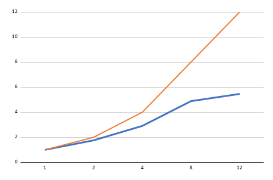

# Relatório do Projeto Final - 2º bimestre (01/2026)

# Identificador de fotos de rosto fake paralelo

**Disciplina: Programação Concorrente e Distribuída** 
**Aluno(s): Daniel Lohan Costa e Silva Dourado e Naylanne Lissa Gomes Cunha** 
**Turma(s): ADS04M1/SIN04M1** 
**Professor: Rafael Marconi Ramos** 
**Data: 26/06/2026**

---

## 1. Descrição do Problema

Foi desenvolvido um programa para realizar a identificação de imagens de rostos, classificando-as como reais ou falsas, utilizando um modelo de aprendizado de máquina treinado com TensorFlow/Keras. Os resultados demonstraram que o modelo apresentou um bom desempenho na tarefa de classificação, atingindo uma taxa de acerto de 93,77%. Isso indica que na maioria dos casos ele conseguiu classificar corretamente as imagens como reais ou falsas. 

Ex:

===== RESULTADOS POR IMAGEM - AMOSTRA ALEATÓRIA =====

|Imagem                          | Esperada   | Predição        | Resultado
|--------------------------------|------------|-----------------|------------
|real\68245.jpg                  | REAL       | FAKE (0.45)     | ❌ Errou
|fake\DX6YLW9BOY.jpg             | FAKE       | FAKE (0.05)     | ✅ Correto
|fake\1IPCLGLR8R.jpg             | FAKE       | FAKE (0.14)     | ✅ Correto
|fake\EUR626P8EY.jpg             | FAKE       | FAKE (0.04)     | ✅ Correto
|real\06120.jpg                  | REAL       | REAL (1.00)     | ✅ Correto
|fake\OWP3Y2ASGK.jpg             | FAKE       | REAL (0.68)     | ❌ Errou
|fake\P8YQEVL0TN.jpg             | FAKE       | FAKE (0.02)     | ✅ Correto
|fake\LYZH5XIB4U.jpg             | FAKE       | FAKE (0.08)     | ✅ Correto
|real\18773.jpg                  | REAL       | FAKE (0.37)     | ❌ Errou
|fake\Y1U6AH0X4T.jpg             | FAKE       | FAKE (0.12)     | ✅ Correto

===== ESTATÍSTICAS DOS DADOS =====

Total de imagens encontradas: 20000 
Total de imagens avaliadas: 20000 
Total de imagens processadas: 20000 
Imagens com erro de leitura: 0 
Acertos: 18753 
Erros: 1247 
Taxa de acerto: 93.77% 

Porém o processamento do grande volume de imagens faz com que o tempo de processamento seja bastante elevado na forma sequencial, já que o código precisa realizar o pré-processamento de cada uma delas e, em seguida, executar a inferência no modelo treinado. Cada imagem passa por etapas como leitura do arquivo, conversão de cores, redimensionamento para o tamanho esperado pelo modelo e predição da classe correspondente.

---

## 2. Objetivo

O objetivo principal do projeto foi aplicar paralelismo no processamento de imagens, reduzindo o tempo total de execução em comparação com a versão serial.

Para explorar o paralelismo, foi utilizado um algoritmo baseado em divisão de dados, onde o conjunto total de imagens é dividido em partes menores, chamadas de fatias e processadas por múltiplos processos utilizando a biblioteca concurrent.futures, por meio da classe ProcessPoolExecutor. Cada processo realiza a leitura das imagens, o pré-processamento e a predição utilizando o modelo carregado com TensorFlow/Keras.

Foram utilizadas 20.000 imagens, separadas entre as classes REAL e FAKE, com o objetivo de avaliar o desempenho da paralelização em um volume significativo de dados.

A complexidade do processamento na versão sequencial pode ser considerada aproximadamente O(n), onde n representa o número total de imagens. Na versão paralela, em um cenário ideal, essa complexidade tende a se aproximar de O(n/p), onde p representa o número de processos utilizados. 

---

## 3. Ambiente Experimental

Os testes foram realizados em um computador com processador Intel Core i7 de 12ª geração, sistema operacional Windows 11 e 16 GB de memória RAM. O programa foi implementado em Python, utilizando TensorFlow/Keras para carregamento do modelo de classificação, OpenCV para leitura e pré-processamento das imagens, NumPy para ajustar o formato para o modelo e ProcessPoolExecutor, por meio do concurrent.futures, para a execução paralela com múltiplos processos.

| Item                        |      Descrição     |
| --------------------------- |      ---------     |
| Processador                 |      i7-12700      |
| Número de núcleos           |         12         |
| Memória RAM                 |        16gb        |
| Sistema Operacional         |     Windows 11     |
| Linguagem utilizada         |   Python 3.10.20   |
| Biblioteca de paralelização | concurrent.futures |
| Biblioteca auxiliar         |  TensorFlow/Keras  |
| Biblioteca auxiliar         |       OpenCV       |
| Biblioteca auxiliar         |        NumPy       |
| Compilador / Versão         |   VScode 1.126.0   |

---

## 4. Metodologia de Testes

O tempo de execução foi medido considerando o processamento completo das imagens na versão serial, incluindo leitura, pré-processamento e inferência pelo modelo.

Após isso, os experimentos foram conduzidos avaliando-se o desempenho do programa em diferentes quantidades de processos.

Na versão paralela, o conjunto de imagens foi dividido em fatias. Cada fatia foi enviada para um processo, que executou a mesma função de processamento sobre aquele subconjunto de imagens. Dentro de cada processo, as imagens foram agrupadas em batches internos para melhorar o desempenho da inferência.

O código utilizou a seguinte estratégia:

Carregamento dos caminhos das imagens;
Divisão das imagens em fatias;
Distribuição das fatias entre processos com ProcessPoolExecutor;
Carregamento do modelo TensorFlow/Keras dentro de cada processo;
Leitura e pré-processamento das imagens com OpenCV;
Predição em batches;
Agrupamento dos resultados no processo principal;
Cálculo do tempo total, taxa de acerto e precisão.

### As configurações testadas foram:

Configuração	Descrição
1 processo	    Execução serial, usada como base de comparação
2 processos	    Execução paralela com 2 processos
4 processos	    Execução paralela com 4 processos
8 processos	    Execução paralela com 8 processos
12 processos	Execução paralela com 12 processos

O tempo serial foi utilizado como referência para o cálculo do speedup. A partir dele, foi possível avaliar o ganho de desempenho obtido com o aumento do número de processos.

---

## 5. Resultados Experimentais

A tabela a seguir apresenta os tempos de execução obtidos para cada quantidade de processos utilizada.

| Nº Threads/Processos | Tempo de Execução (s) |
| -------------------- | --------------------- |
| 1                    |         1480          |
| 2                    |          842          |
| 4                    |          509          |
| 8                    |          303          |
| 12                   |          271          |

Observa-se que o tempo de execução diminuiu conforme o número de processos aumentou. A versão serial levou 1480 segundos, enquanto a execução com 12 processos reduziu o tempo para 271 segundos.

---

## 6. Cálculo de Speedup e Eficiência

Fórmula do Speedup

O speedup indica quantas vezes a versão paralela foi mais rápida em relação à versão serial.

Speedup(p) = T(1) / T(p)

Onde:

T(1) = tempo da execução serial;
T(p) = tempo da execução com p processos.
Fórmula da Eficiência

A eficiência indica o quanto os processos foram bem aproveitados em relação ao speedup ideal.

Eficiência(p) = Speedup(p) / p

Onde:

p = número de processos utilizados.

Para apresentar em porcentagem:

Eficiência (%) = (Speedup(p) / p) × 100

---

## 7. Tabela de Resultados

| Threads/Processos | Tempo (s) | Speedup | Eficiência |
| ----------------- | --------- | ------- | ---------- |
| 1                 |   1480    |   1.0   |    100     |
| 2                 |    842    |   1.8   |    088     |
| 4                 |    509    |   2.9   |    073     |
| 8                 |    303    |   4.9   |    061     |
| 12                |    271    |   5.5   |    046     |

Apesar do ganho de tempo em todas as versões paralelas em comparação com a versão serial a eficiência diminuiu conforme o número de processos aumentou.

---

## 8. Gráfico de Tempo de Execução

Gráfico mostrando o **tempo de execução em função do número de processos**.

Eixo X: número de processos
Eixo Y: tempo de execução (segundos)

A tendência esperada é uma curva decrescente, mostrando que o tempo total diminui com o aumento da quantidade de processos.

---

## 9. Gráfico de Speedup

Gráfico mostrando o **speedup obtido**.

Eixo X: número de processos
Eixo Y: speedup

A comparação entre as duas linhas permite observar o quanto o desempenho real se aproxima ou se distancia do desempenho teórico esperado.

---

## 10. Gráfico de Eficiência

Gráfico mostrando a **eficiência da paralelização**.

Eixo X: número de processos
Eixo Y: eficiência

A eficiência apresenta queda conforme o número de processos aumenta, o que indica que o ganho de desempenho não cresce na mesma proporção que a quantidade de processos utilizados.

---

## 11. Análise dos Resultados

Os resultados obtidos demonstram que o uso de paralelismo trouxe ganho real de desempenho em relação à execução serial. O tempo total foi reduzido de 1480 segundos, na execução com 1 processo, para 271 segundos, na execução com 12 processos.

Com 2 processos, o tempo caiu para 842 segundos, resultando em speedup de aproximadamente 1,8 e eficiência de 88%. Esse resultado ficou relativamente próximo do ideal, indicando bom aproveitamento dos processos.

Com 4 processos, o tempo foi reduzido para 509 segundos, com speedup de 2,9 e eficiência de 73%. Esse resultado mostra um bom equilíbrio entre redução de tempo e aproveitamento dos recursos, sendo considerado o maior ponto de eficiência da análise.

Com 8 processos, o tempo caiu para 303 segundos, resultando em speedup de 4,9 e eficiência de 61%. Embora a eficiência tenha diminuído em relação à execução com 4 processos, ainda houve um ganho real no tempo absoluto, pois o tempo foi reduzido de 509 segundos para 303 segundos, uma diferença de 206 segundos. Porém o speedup ficou muito distante do ideal, o que faz com que esse não seja o melhor cenário.

Com 12 processos, o menor tempo absoluto foi alcançado, com 271 segundos, entretanto, o ganho em relação à execução com 8 processos foi de apenas 32 segundos, mesmo utilizando 4 processos a mais. Além disso, a eficiência caiu para 46%, indicando que o aumento no número de processos passou a gerar menor retorno proporcional.

Dessa forma, é possível observar dois fatores: apesar do menor tempo total ter sido obtido com 12 processos o custo foi muito alto e a eficiência caiu bastante, enquanto que o equilíbrio entre speedup, eficiência e custo-benefício foi obtido com até 4 processos, sendo o melhor resultado prático.

A partir de 8, o programa ainda apresentou redução no tempo total, mas com perda progressiva de eficiência. Isso mostra que o paralelismo trouxe ganhos cada vez menores a partir disso.

Uma das principais causas para essa queda de eficiência está relacionada ao uso do TensorFlow em conjunto com multiprocessamento, aumentando o consumo de memória RAM e a disputa por recursos da máquina.

Além disso, o TensorFlow já possui mecanismos internos de paralelismo para executar operações matemáticas pesadas, como convoluções e multiplicações de matrizes. Ao utilizar vários processos externos ao mesmo tempo, pode ocorrer sobreposição de paralelismo, gerando contenção por CPU, memória, cache e leitura de disco.

Outro fator que influencia o desempenho é a leitura das imagens com cada processo realizando leitura de arquivos, conversão de cores, redimensionamento e transformação para float32, o aumento da quantidade de processos também pode gerar disputa por acesso ao disco e maior uso de memória.

Portanto, a queda de eficiência não indica necessariamente erro na implementação. Ela demonstra uma limitação prática do paralelismo, em que o aumento no número de processos deixa de trazer ganho proporcional devido ao overhead de gerenciamento, carregamento do modelo, comunicação entre processos e contenção de recursos de hardware.

---

## 12. Conclusão

Com base nos resultados obtidos, conclui-se que a aplicação de paralelismo no identificador de fotos de rosto fake trouxe ganho significativo de desempenho em relação à execução serial.

A versão serial levou 1480 segundos para processar as imagens, enquanto a versão paralela com 12 processos reduziu esse tempo para 271 segundos. Isso demonstra que a divisão do trabalho entre múltiplos processos contribuiu para acelerar o processamento.

Entretanto, o speedup obtido não foi ideal. Em um cenário teórico perfeito, 12 processos poderiam alcançar speedup próximo de 12. Porém, o speedup obtido foi de aproximadamente 5,5. Isso mostra que o programa apresentou escalabilidade parcial, mas não linear.

O melhor equilíbrio entre desempenho e eficiência foi observado com 4 processos. Nessa configuração, o tempo foi reduzido para 509 segundos, com speedup de 2,9 e eficiência de 73%. Esse resultado indica bom aproveitamento dos recursos, mantendo uma eficiência ainda relativamente alta.

Dessa forma, pode-se concluir que o aumento do número de processos nem sempre resulta no melhor custo-benefício. Para este trabalho, 4 processos representaram o melhor ponto de equilíbrio técnico, enquanto 12 processos representaram o menor tempo absoluto.

A perda de eficiência pode ser explicada pelo overhead de paralelização, pela leitura simultânea de um grande volume de arquivos, pelo carregamento de uma instância do modelo TensorFlow em cada processo e pela disputa por recursos de CPU, memória e cache.

De forma geral, o experimento demonstrou na prática os benefícios e limitações do paralelismo. O trabalho evidenciou que a paralelização pode reduzir significativamente o tempo de execução, mas que o ganho depende dos recursos disponíveis, do tipo de tarefa executada e dos custos adicionais envolvidos no gerenciamento dos processos.

---

## 13. Etapas do projeto:

. Definição do tema: Indentificador de fotos de rosto fake paralelo 
. Objetivo: paralelizar um identificador de imagens de rostos reais ou fakes, a fim de agilizar esse processo. 
. Base de dados: https://www.kaggle.com/datasets/troykueh/real-vs-fake-faces-stylegan3 
. Treinamento do modelo: 
. Primeiro, foi utilizado o código de treinamento já disponibilizado junto à base de dados do Kaggle. Esse treinamento teve como objetivo ensinar o modelo a diferenciar imagens de rostos reais e imagens de rostos fake. 
. Após o treinamento, o modelo foi salvo em um arquivo no formato .keras. Esse arquivo passou a representar o modelo já treinado, pronto para ser utilizado na classificação das imagens. 
. No código do projeto, o modelo salvo foi carregado utilizando o TensorFlow/Keras. Dessa forma, não foi necessário treinar o modelo novamente durante as execuções, apenas carregar o arquivo já treinado. 
. Em seguida, o programa percorreu a pasta de imagens de teste, separadas entre imagens reais e imagens fake. 
. Antes de enviar cada imagem para o modelo, foi necessário preparar a imagem. Para isso, a imagem foi lida com OpenCV, convertida para o padrão de cores RGB, redimensionada para o tamanho esperado pelo modelo e transformada para o formato numérico float32. 
. Depois do pré-processamento, a imagem foi enviada ao modelo para que ele realizasse a predição. O modelo retornava um resultado indicando se a imagem era classificada como real ou fake. 
. O resultado previsto pelo modelo foi comparado com a classe real da imagem, de acordo com a pasta em que ela estava armazenada. Assim, foi possível contabilizar os acertos e erros. 
. Após o treinamento, implementou-se as execuções de predição, esse processo foi realizado primeiramente de forma sequencial, analisando uma imagem por vez, e posteriormente foi criada uma versão paralela, na qual as imagens foram divididas entre vários processos para tentar reduzir o tempo total de execução. 
. Por fim, foram avaliados os tempos totais das execuções, a quantidade de imagens processadas, a taxa de acerto, o speedup e a eficiência da versão paralela em comparação com a versão sequencial. 

---

## 14. Como Executar:

1. Iniciar ambiente virtual: .venv\Scripts\Activate.ps1 
2. Instalar as dependências do projeto: pip install -r requirements.txt 
3. Verificar se o modelo treinado está na pasta correta: model/face_detector_model.keras 
4. Verificar se as imagens de teste estão na pasta correta: teste_imagens/ 
5. A estrutura esperada é: 
teste_imagens/ 
├── real/ 
└── fake/ 
6. Executar a versão sequencial: python serial.py 
7. Executar a versão paralela informando a quantidade de processos: Ex: python paralelo.py 2 
8. Testando as outras quantidades de processos: 
python paralelo.py 4 
python paralelo.py 8 
python paralelo.py 12 
9. Ao final da execução, o programa exibirá os resultados no terminal, como: 
Total de imagens encontradas 
Total de imagens avaliadas  
Total de imagens processadas 
Imagens com erro de leitura 
Acertos 
Erros 
Taxa de acerto 
Tempo total de execução 
Tempo médio por imagem 
Processos utilizados 
11. Para sair do ambiente virtual: deactivate
